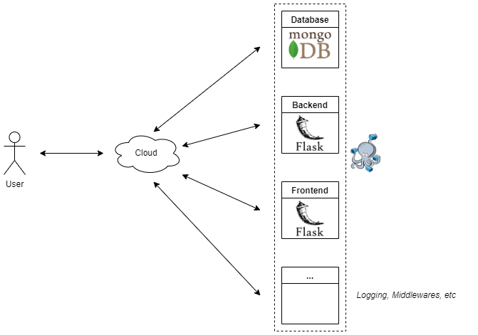

# Password Generator

## Sumário

- [Password Generator](#password-generator)
  - [Sumário](#sumário)
  - [Requisitos](#requisitos)
  - [*Design*](#design)
    - [Arquitetura do Projeto](#arquitetura-do-projeto)
    - [Descrição dos Requisitos](#descrição-dos-requisitos)
  - [Estrutura do Projeto](#estrutura-do-projeto)
  - [Tecnologias Utilizadas](#tecnologias-utilizadas)
  - [Ferramentas Utilizadas](#ferramentas-utilizadas)
  - [Execução do Projeto (*Docker Compose*)](#execução-do-projeto-docker-compose)

## Requisitos

1. Sistema gera senha aleatória baseada em políticas de complexidade (tipo de caracteres, números, letras, tamanho, etc);
    - Exemplo: o usuário ao clicar no botão "Gerar Senha" irá obter uma senha aleatória;
2. Usuário irá especificar quantas vezes a senha gerada poderá ser vista e qual o tempo que a senha ficará válida;
    - Exemplo: o usuário irá especificar que a senha possa ser vista apenas duas vezes pelo prazo de um dia;
3. O sistema irá gerar uma URL que dá acesso a visualização da senha, baseando-se nos critérios do item 02;
    - Exemplo: o usuário enviará a URL para que o cliente possa visualizar a senha;
4. Após atingir a quantidade de visualizações ou o tempo disponível, o sistema bloqueia/elimina a visualização da senha (expirado). A senha não deve ser armazenada após sua expiração.

## *Design*

### Arquitetura do Projeto

A imagem a seguir descreve a arquitetura da aplicação, adotando uma arquitetura *serverless* onde cada componente da aplicação é divido em serviços (Arquitetura de microserviços).

De uma forma abstrata o item ***cloud*** pode ser substituído por qualquer provedor de computação em nuvem.

Uma forma de simular esta arquitetura foi utilizado *Docker Compose*, onde cada serviço possui um *container* distinto.

O *Frontend* realiza requisições HTTP ao *Backend* para as rotas de listagem, obtenção e criação de senhas.

A persistência dos dados é utilizando o **MongoDB**.



### Descrição dos Requisitos

**#01**: No diretório `src/password_generator/helpers.py` é possível identificar uma classe denominada `PasswordGenerator` que possui a responsabilidade única e exclusiva de gerar as senhas de acordo com os critérios enviados. Os seguintes critérios são utilizados para geração da senha:

- Comprimento da Senha
- É permitido caracteres numéricos?
- É permitido caracteres especiais?
- É permitido caracteres alfabéticos? Se sim:
  - Maiúsculos?
  - Minúsculos?

**#02**: Ao realizar a criação de uma nova senha, é necessário especificar a data de expiração e a quantidade máxima de visualizações.

- Data de Expiração: **Obrigatoriamente** precisa ser maior que a data/hora corrente.
- Quantidade Máxima de Visualizações: **Obrigatoriamente** no mínimo 1 (uma) visualização.

**#03**: Ao criar a senha é gerado um *UUID4* de 36 caracteres, onde ele é utilizado para ser o identificador único de cada senha. No *frontend*, após criar a senha, é possível clicar no botão `Copiar link` e é automaticamente colocado na área de transferência do usuário.

**Ponto de atenção**: Se o projeto estiver executado com o *Docker*, será necessário sustituir o identificador do *container* (`password-generator-backend`) pelo *host* da máquina (*localhost*, 127.0.0.1, etc). Ex.: http://password-generator-backend:5000/passwords/ por http://localhost:5000/passwords/.

**#04**: São realizadas duas verificações para o cumprimento deste requisito, abaixo serão descritos:

- **Quantidade máxima de visualizações:** Cada acesso ao *link* da senha é efetuado um incremento na quantidade de visualizações realizadas e automaticamente comparado com a quantidade máxima de visualizações, se esta condição for atendida, realizar automaticamente a exclusão. Este requisito foi atendido com o auxílio dos *Signals* do *MongoEngine*, onde é possível disparar um evento a cada operação realizada em um documento, neste caso uma atualização no documento.
- **Expiração por data/hora:** Utilizando *Flask-APScheduler* foi adicionado uma *task* que valida a cada **minuto** se uma senha foi expirada, se sim, é automaticamente excluída da base. Esta decisão foi tomada visto que pode-se cadastrar senhas com as horas quebradas, por exemplo, 20/01/2022 às 12:56.

## Estrutura do Projeto

```bash
.
├── Dockerfile
├── LICENSE
├── README.md
├── docker-compose.yml
├── requirements.txt
├── setup.py
├── src
│   ├── frontend
│   │   ├── __init__.py
│   │   ├── config.py
│   │   ├── forms.py
│   │   ├── helpers.py
│   │   ├── static
│   │   │   ├── css
│   │   │   │   └── base.css
│   │   │   └── js
│   │   │       ├── index.js
│   │   │       └── new_password.js
│   │   └── templates
│   │       ├── base.html
│   │       ├── index.html
│   │       └── new_password.html
│   └── password_generator
│       ├── __init__.py
│       ├── config.py
│       ├── helpers.py
│       ├── models.py
│       ├── tasks.py
│       ├── urls.py
│       └── views.py
└── startup.sh

7 directories, 24 files
```

## Tecnologias Utilizadas

- Python 3.8
- Jinja2, HTML5, CSS3, Javascript
- Flask 2.0.2
- MongoDB *latest*
- Docker 20.10.11
- Docker Compose 1.29.2

## Ferramentas Utilizadas

- _Windows 10_
- _Ubuntu 20.04 LTS (WSL2)_
- _Visual Studio Code_

## Execução do Projeto (*Docker Compose*)

Gerar o _build_ do projeto a partir do arquivo _docker-compose.yml_:

```sh
    docker-compose build
```

Iniciar os containers do _MongoDB_, _Backend_ e _Frontend_ de forma desacoplada:

```sh
    # No Linux
    chmod +x startup.sh
    bash startup.sh

    # Em outros SOs
    docker-compose up -d
```

O *frontend* estará disponível em [http://localhost/](http://localhost/).

Para a API de senhas utilizar [http://localhost:5000/passwords/](http://localhost:5000/passwords/).
